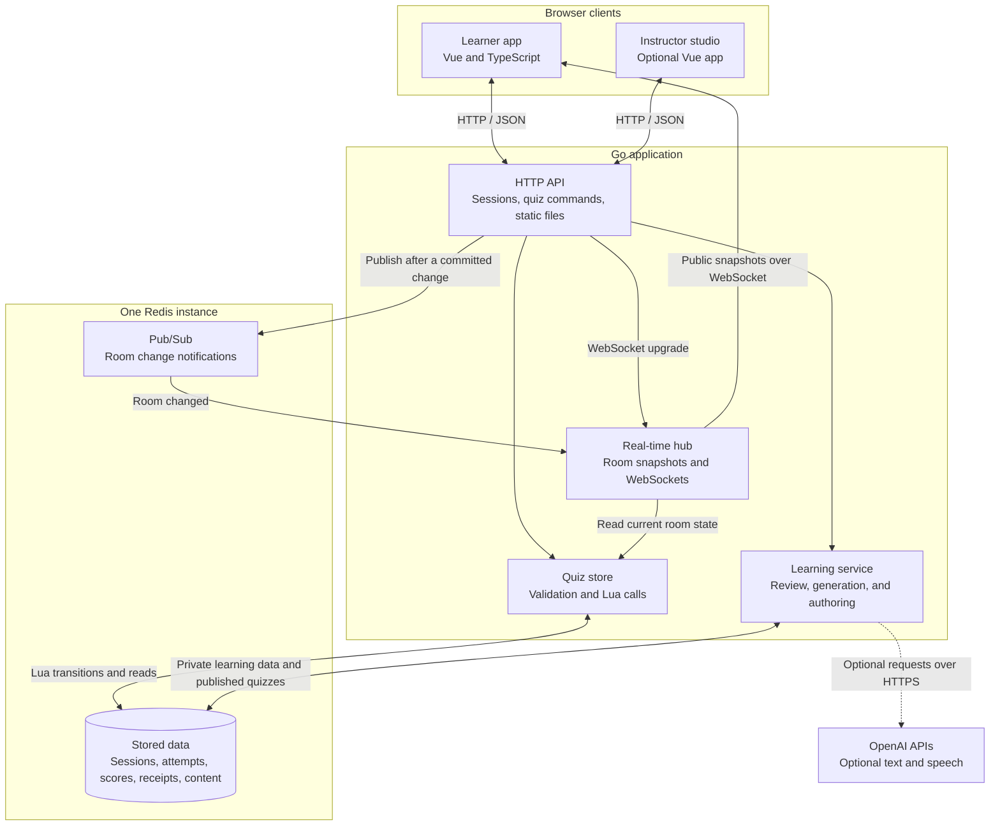

# Vocabulary Live

Vocabulary Live is a multiplayer vocabulary quiz built for the [ELSA engineering challenge](https://github.com/elsa/coding-challenges). Learners join a room, answer at their own pace, and see everyone's scores on a live leaderboard. Each learner gets the same questions in an independently shuffled order, with immediate feedback after each answer.

The application uses **Go, Vue, and Redis**. Go checks answers, Redis stores progress and scores, and Vue handles the learner experience. The two demo quizzes work without an AI provider. Optional pronunciation, explanations, and an instructor studio add learning features around the core quiz.

- [Run locally](#run-locally)
- [System design](#system-design)
- [Configuration](#configuration)
- [Optional learning and instructor studio](#optional-learning-and-instructor-studio)
- [Development and testing](#development-and-testing)

## Run locally

Install Docker with Compose v2, then run:

```sh
docker compose up --build
```

Open [localhost:8080](http://localhost:8080) and join either room:

| Room code     | Topic               | Questions |
| ------------- | ------------------- | --------- |
| `VOCAB-DEMO`  | Everyday vocabulary | 8         |
| `TRAVEL-DEMO` | Travel vocabulary   | 8         |

Enter a name, select an option, and choose **Check answer**. Read the feedback, then choose **Next question**. After the last question, the app shows your score, accuracy, current rank, and missed words for review. Other learners can continue answering, so your rank may still change.

To try multiplayer, use separate browser profiles or different browsers. Ordinary tabs in the same profile share a session cookie and count as one participant. Names do not need to be unique.

Reloading the same tab restores progress, question order, and unread feedback while the anonymous session remains valid. The interface supports mobile layouts, keyboard controls, reduced motion, and light and dark themes.

## System design

The main design goal is to keep scores correct when requests overlap, connections fail, or a learner reloads the page. Redis holds the shared quiz state. The browser displays confirmed results and keeps enough local information to recover an unfinished request.

### Architecture

The default deployment has one Go application and one Redis instance. The Go application serves the built Vue files, the HTTP API, and WebSocket connections. The boxes inside the Go service below are packages in the same process.



HTTP carries commands and private results. WebSockets carry public leaderboard snapshots and connection status. Redis Pub/Sub tells the hub that a room has changed; the hub then reads the current state from Redis. Notifications do not contain the authoritative score data.

### Components and responsibilities

| Component                              | Responsibility                                                                                                                                                                                         | Main code                                                                                                                               |
| -------------------------------------- | ------------------------------------------------------------------------------------------------------------------------------------------------------------------------------------------------------ | --------------------------------------------------------------------------------------------------------------------------------------- |
| Learner client                         | Shows questions, feedback, timers, and standings. The quiz state machine owns pending answers, retries, and reconnection. It updates scores from server snapshots.                                     | [QuizMachine](frontend/src/lib/quiz-machine.ts), [Vue components](frontend/src/components)                                              |
| HTTP API                               | Creates anonymous sessions, validates requests and origins, checks membership, applies request limits, and serves private quiz state. It also serves the frontend in the built application.            | [HTTP server](backend/internal/httpapi/server.go)                                                                                       |
| Quiz domain and store                  | Loads quiz definitions, creates shuffled attempt plans, checks answers, and calls Redis scripts. The Lua transition keeps answer acceptance, progress, and score updates together.                     | [Domain](backend/internal/domain), [store](backend/internal/store/store.go), [transition script](backend/internal/store/transition.lua) |
| Real-time hub                          | Subscribes to room changes, reads consistent snapshots, and sends them to connected learners. It manages connection expiry, slow clients, and recovery after missed notifications.                     | [Hub](backend/internal/realtime/hub.go)                                                                                                 |
| Redis                                  | Stores session identities, room membership, attempt plans, deadlines, answer receipts, and scores. The same instance provides Pub/Sub and stores published quiz content.                               | [Redis configuration](compose.yaml), [published quiz repository](backend/internal/store/published.go)                                   |
| Learning service and instructor studio | Provides optional speech and explanations, private review, and a draft-to-publication workflow. Generated content passes through validation and instructor approval before it becomes a joinable quiz. | [Learning service](backend/internal/learning), [instructor client](frontend/src/InstructorApp.vue)                                      |
| Observability                          | Exposes health checks and Prometheus metrics. Structured logs include request IDs, route names, outcomes, and dependency failures.                                                                     | [Metrics](backend/internal/observability/metrics.go), [server entry point](backend/cmd/server/main.go)                                  |

The seeded question definitions and answer keys live in [backend fixtures](backend/internal/fixtures). Published quizzes are read from Redis. Before an answer is accepted, the learner receives the question and its choices without the answer key or explanation. After acceptance, private feedback includes those details. Public WebSocket messages never include a learner's selected answers or explanations.

### Data flow: from joining to a leaderboard update

1. **Create or resume a session.** The browser calls `POST /api/session`. Go creates a random credential or resolves the existing cookie to a participant ID. Redis stores a hash of the credential with a seven-day expiry. The cookie is `HttpOnly` and `SameSite=Lax`; production mode also requires `Secure` cookies.

2. **Join the quiz.** The browser sends its display name to `POST /api/quizzes/{quizId}/join`. Go generates a shuffled question and option plan for a new participant. Lua saves the plan, membership, and initial score together, subject to the room capacity. Joining again with the same identity preserves the existing plan and progress. The response includes the current question, private progress, and leaderboard.

3. **Start the question timer.** The client calls `POST /api/quizzes/{quizId}/start`. Lua uses Redis time to create a deadline and returns it with the current server time. Repeated calls return the same deadline. Reloading the page does not restart the countdown.

4. **Open the live connection.** The browser connects to `/api/quizzes/{quizId}/live`. The server checks the session, origin, and room membership before upgrading to WebSocket. The hub registers the connection and reads a fresh room snapshot so the learner can catch up with changes made during connection setup.

5. **Submit an answer.** Before sending anything, the client saves the selected option and a new `submissionId` in the tab's `sessionStorage`. It then calls `POST /api/quizzes/{quizId}/answers` with the question ID, option ID, submission ID, and room epoch. This saved request lets a reload recover an answer whose result is still unknown.

6. **Accept and record the result.** Go validates the question and option against the server's quiz definition. Lua checks the epoch, membership, duplicate request, and previous answer. It uses Redis time to decide the points, then stores a receipt, updates the score and progress, and increments the room version in the same operation. The receipt records what was accepted and is preserved for retries.

7. **Return private feedback.** After acceptance, the API publishes a room change notification and returns the receipt. The browser shows the feedback and fetches private state to confirm its current score and next question. It keeps the feedback visible until the learner chooses **Next question**, then starts that question's timer.

8. **Refresh everyone's leaderboard.** Each subscribed hub marks the room for refresh. On its next refresh cycle, it reads a consistent snapshot with ranks and sends the public snapshot to connected learners. Clients check its epoch and version before applying it. The answer response and WebSocket update travel independently, so either can arrive first.

The API also publishes a change after a new participant joins, so learners with zero points appear in the standings too.

### Scoring and ranking

| Answer result                                 | Points |
| --------------------------------------------- | ------ |
| Correct and accepted before the deadline      | 100    |
| Correct and accepted at or after the deadline | 50     |
| Incorrect                                     | 0      |

Questions allow 20, 30, or 40 seconds according to their difficulty. The countdown is a display of the server's deadline. Scoring uses the time Redis accepts the answer, so an answer clicked just before zero may arrive too late for full points. An answer without a stored deadline is treated as late. Learners can keep answering after zero.

Only the first accepted answer counts for each participant and question. An incorrect answer consumes that attempt too. Retrying an accepted answer returns its original receipt and points, even if the deadline has since passed.

The leaderboard includes everyone who joined, including disconnected learners and those with zero points. Equal scores share a rank, such as **1, 1, 3**. Participant IDs keep the order within a tie stable; they do not break the tie. Completion is individual, so there is no shared end-of-quiz barrier.

### Stored data

Each room uses keys under `<namespace>:quiz:{<quizId>}:`. The braces keep a room's keys in one Redis hash slot. The application currently connects to a single Redis primary.

| Key suffix     | Redis type | Contents                                                                                |
| -------------- | ---------- | --------------------------------------------------------------------------------------- |
| `meta`         | Hash       | Room epoch, version, content version, capacity, and question manifest                   |
| `participants` | Hash       | Display name, answered count, and progress cursor for each participant                  |
| `attempts`     | Hash       | The saved question order and option order for each participant                          |
| `timers`       | Hash       | The deadline for each participant and question                                          |
| `scores`       | Sorted set | Participant IDs ordered by score                                                        |
| `answers`      | Hash       | Accepted receipts indexed by participant and question; enforces one answer per question |
| `requests`     | Hash       | The same receipts indexed by participant and submission ID; makes retries safe          |

An **epoch** identifies one lifetime of a room. Resetting a room creates a new epoch, so an old pending answer cannot be applied to the new game. The **version** increases with each accepted join or answer. Clients use it to reject older snapshots. The **content version** ties stored attempts to the quiz definition and scoring policy.

Sessions use separate keys under `<namespace>:session:`. Learning artifacts, review sessions, and authoring data have their own keys in the same namespace. Room progress does not expire when a session expires; the previous participant remains in the standings.

### Consistency and failure recovery

Answer writes and snapshot reads run through Lua so concurrent requests cannot interleave with those operations. The scripts check stored types and values before writing. Lua provides isolation, but it does not roll back earlier writes if a script fails partway through.

Leaderboard delivery is eventually consistent: an answer can be accepted before every browser has received the new standings. The hub groups changes into **80 ms refresh cycles** and rereads active rooms every **2 seconds**. This reduces repeated reads during a burst and repairs a missed Pub/Sub notification.

| Situation                                              | How the system handles it                                                                                                                                                                          |
| ------------------------------------------------------ | -------------------------------------------------------------------------------------------------------------------------------------------------------------------------------------------------- |
| The same answer request arrives twice                  | The saved `submissionId` returns the original receipt. Reusing that ID with a different question or option returns a conflict.                                                                     |
| Two tabs answer the same question                      | The participant/question guard accepts one result. The other request receives the existing receipt.                                                                                                |
| Redis accepts an answer, but the HTTP response is lost | The client keeps the pending request. Recovery first reads private state. It uses the saved receipt if present; otherwise, it resends the same submission ID and payload.                          |
| Publishing a room notification fails                   | The accepted answer stays committed. The hub's periodic snapshot read picks up the change.                                                                                                         |
| A WebSocket disconnects                                | The browser shows the last known standings, retries with increasing delays and jitter, and fetches private state before reconnecting. Answer submission can continue while HTTP remains available. |
| A browser is slow to receive updates                   | Each connection has one queued snapshot. A newer snapshot replaces the queued one, preventing that client from blocking the room.                                                                  |
| Redis is unavailable                                   | The API reports a dependency failure, readiness fails, and clients retain their last confirmed state. Recovery checks whether an uncertain request was accepted.                                   |
| A session expires or a room resets                     | The UI asks the learner to recover explicitly. It does not replay an old pending answer under a new identity or epoch.                                                                             |

### Technologies and tools

These are the versions and choices recorded in this repository. Exact dependencies are pinned in [go.mod](backend/go.mod), [package.json](frontend/package.json), and the build configuration.

| Technology                                       | Use and reason for the choice                                                                                                                                                                                                  |
| ------------------------------------------------ | ------------------------------------------------------------------------------------------------------------------------------------------------------------------------------------------------------------------------------ |
| Go 1.27.1 with `net/http`                        | Runs the API and live connections in one service. Goroutines support concurrent requests and socket work, while contexts give dependency calls clear time limits.                                                              |
| Vue 3.5.43 and TypeScript 5.9.3                  | Build the learner and instructor interfaces. Vue keeps the views reactive; a separate TypeScript state machine makes retries and recovery testable without rendering the whole UI. Incoming JSON is also validated at runtime. |
| Redis 8.10.2, Lua, and `go-redis`                | Keep shared state and scoring transitions in one place. Hashes fit participant records, sorted sets fit scores, and Lua protects updates when requests race. This makes Redis a required dependency for quiz operations.       |
| Native WebSockets and Gorilla WebSocket          | Deliver public standings through a persistent connection. The protocol sends complete snapshots, so reconnecting clients can recover from the current state without replaying every event.                                     |
| Redis Pub/Sub                                    | Notifies every application instance that a room changed. Periodic reads provide recovery because these notifications are not a durable event log.                                                                              |
| Vite 8.3.0 and Node 24.14.0                      | Provide frontend development, type checking, and asset builds. Node is needed for tooling; the built application serves static files from Go.                                                                                  |
| Docker and Compose                               | Run the same app and Redis setup locally. The multi-stage build packages the Go binary and frontend into a small runtime image that runs as a non-root user.                                                                   |
| Prometheus client and Go `slog`                  | Expose request outcomes, answer and snapshot latency, active sockets, and dependency failures. Request IDs help connect a client error to its server log.                                                                      |
| Go tests, Vitest, Playwright, and GitHub Actions | Check different boundaries: real Redis for concurrent scoring, Vitest for client recovery, and browser tests for full user journeys. The CI workflow runs the shared verification command.                                     |
| OpenAI text and speech APIs, optional            | Supply pronunciation and learning material on request. A server-side provider interface keeps credentials out of the browser and lets automated tests use a deterministic provider.                                            |

### Deployment boundaries and trade-offs

The current room limit is **200 joined participants**, including disconnected participants. Sending a full leaderboard on every update is simple to recover and reasonable within that bound. A larger room would need fresh measurements and a review of snapshot size, fan-out cost, and Redis work. The limit is an enforced cap, not a measured throughput claim.

The core quiz path can share state across Go instances: sessions and attempts live in Redis, and each instance has its own hub subscribed to the same channel. The supplied Compose setup runs one instance. HTTP rate limits, AI concurrency limits, and generation caches are local to each process, so running more instances would require a plan for shared limits and provider budgets.

Redis uses a persistent volume with AOF enabled and `appendfsync everysec`. This supports restart recovery, but a crash can still lose recently acknowledged writes. The supplied setup has no Redis replication or automatic failover. Authoring publication also touches keys outside a room's hash slot, so this implementation does not support Redis Cluster as a drop-in replacement.

Compose binds the app to loopback, and Redis is internal unless the development override is used. An HTTPS deployment needs TLS termination, exact allowed origins, and the actual proxy addresses in `TRUSTED_PROXY_CIDRS`. Health and metrics endpoints have no separate authentication and should be reachable only by the intended operators and monitoring system.

Anonymous sessions are suitable for this practice app. They do not prevent someone from joining with several identities. The instructor studio uses a single operator secret and has no multi-user role model.

## Configuration

The defaults work for local Docker use. To override them, create a `.env` from [.env.example](.env.example) if one does not already exist. Keep existing values when editing it. Compose reads this file; host commands such as `make dev` read exported environment variables instead.

| Setting                                     | Purpose                                                                                      |
| ------------------------------------------- | -------------------------------------------------------------------------------------------- |
| `APP_PORT`                                  | Host port for Compose; defaults to `8080`                                                    |
| `APP_ENV`                                   | `development` for local HTTP; `production` requires HTTPS origins and enables Secure cookies |
| `REDIS_NAMESPACE`                           | Prefix for this deployment's data; defaults to `vocab-practice`                              |
| `REDIS_URL`                                 | Redis address for host commands; Compose supplies its internal Redis address                 |
| `ALLOWED_ORIGINS`                           | Exact browser origins allowed for write requests and WebSocket connections                   |
| `TRUSTED_PROXY_CIDRS`                       | Actual proxy IP ranges; leave empty for direct access                                        |
| `RATE_LIMIT_PER_SECOND`, `RATE_LIMIT_BURST` | Per-IP API request limits in each application process; defaults are `10` and `40`            |
| `HTTP_ADDR`, `STATIC_DIR`                   | Listen address and frontend build directory when running Go directly                         |

The service exposes `/healthz` for liveness, `/readyz` for Redis connectivity, and `/metrics` for Prometheus. Compose uses readiness for its application health check.

### Resetting the demo

A normal restart preserves quiz progress. To clear the two seeded rooms deliberately:

```sh
docker compose exec -e ALLOW_DEMO_RESET=yes app /app --demo-reset
```

Reset is allowed only in development mode. It removes the seeded rooms' membership, plans, scores, deadlines, and receipts, and creates new epochs. It retains session identities, published quizzes, and unrelated Redis data. Connected learners must rejoin.

Startup checks the stored content version. There is a narrow upgrade path from the preceding untimed practice policy that preserves saved orders, scores, and receipts. Other incompatible data needs a fresh namespace or an intentional reset; startup does not silently replace it.

## Optional learning and instructor studio

The quiz, fixed answer feedback, and missed-word review work without an API key. To enable generated learning material, set `OPENAI_API_KEY` in your local environment and recreate the Compose app with `docker compose up -d --build`.

The server checks the key with a cached Models read request before exposing learning controls. A key that cannot pass that check leaves those controls unavailable. The repository defaults are `gpt-5.4-mini` for text and `gpt-4o-mini-tts` with the `cedar` voice for speech. They can be changed through `OPENAI_TEXT_MODEL`, `OPENAI_TTS_MODEL`, and `OPENAI_TTS_VOICE`. Speech and text learning have separate switches: `OPENAI_TTS_ENABLED` and `AI_LEARNING_ENABLED`.

Learners can request pronunciation, explanations, examples, and study suggestions. Private review does not change quiz scores. The learning service limits concurrent generation, caches results, and validates provider responses. A slow or failed generation request does not change an accepted answer or its deadline. API keys stay on the server.

Authoring is disabled by default. To enable it, set `AI_AUTHORING_ENABLED=true` and a random `AUTHORING_ADMIN_SECRET` of at least 32 characters, then open `/instructor`. The operator generates a draft of 4–8 questions, edits and saves it, approves each saved question, and completes the final review. Publishing creates a new quiz code with an immutable definition. It leaves the two seeded rooms unchanged. Difficulty and teaching quality still require instructor judgment.

## Development and testing

For host development, use Go **1.27.1**, Node **24.14.0**, npm, Redis **8.10.2**, and a C compiler for Go's race detector. The full verification setup uses Linux or WSL and Playwright Chromium. Docker is the simplest way to run the app without installing those host tools.

From the repository root in a Linux or WSL shell:

```sh
npm ci --prefix frontend
docker compose -f compose.yaml -f compose.dev.yaml up -d redis
export REDIS_URL=redis://127.0.0.1:6379/0
cd frontend
npx playwright install --with-deps chromium
cd ..
make dev
```

Open [localhost:5173](http://localhost:5173). Vite proxies `/api`, including WebSockets, to Go on port 8080. Adjust `REDIS_URL` if your Redis server uses a different address. Keep it exported when running tests; the learning test server requires it. Stop an existing app on port 8080 before starting the development server.

| Command                 | What it does                                                                          |
| ----------------------- | ------------------------------------------------------------------------------------- |
| `make dev`              | Starts Go and the Vite development server                                             |
| `make build`            | Type-checks and builds the frontend, then compiles Go into `dist/`                    |
| `make up` / `make down` | Starts/builds or stops Compose; stopping retains the Redis volume                     |
| `make fmt-check`        | Checks Go and frontend formatting                                                     |
| `make lint`             | Runs `go vet`, including integration files, and ESLint                                |
| `make typecheck`        | Runs the strict Vue and TypeScript check                                              |
| `make test-unit`        | Runs Go unit tests with the race detector and frontend Vitest tests                   |
| `make test-integration` | Runs the backend suite with the race detector and a real Redis server                 |
| `make test-e2e`         | Runs the quiz and learning browser suites against Go and Redis                        |
| `make verify`           | Runs formatting, lint, types, unit tests, integration tests, build, and browser tests |
| `make load-test`        | Runs 100 HTTP/WebSocket clients across two rooms, submitting 800 answers              |
| `make demo-reset`       | Resets the two seeded rooms in the namespace configured for host commands             |

Each Make target delegates to `node scripts/task.mjs <target>`, so Make is optional. The [CI workflow](.github/workflows/verify.yml) runs `make verify` and builds the Docker image. Test commands fail when a required dependency is missing. Run `make build` before using `make test-e2e` on its own so the browser tests use the current code.

Tests cover duplicate and concurrent answers, deadline boundaries, lost HTTP responses, missed Pub/Sub notifications, Redis outages, session expiry, and stale snapshots. Browser journeys exercise separate participant contexts, mobile layouts, keyboard access, themes, and reduced motion. Test results and benchmark timings should come from an actual run in the target environment.

The core browser suite uses port 8080 by default (`E2E_PORT` can override it) and resets only `vocab-e2e`. The learning suite uses port 18082 and its own `vocab-ai-e2e` namespace. It runs a separate test executable with a deterministic provider and an audio fixture; it makes no OpenAI calls. Run the browser suites sequentially and keep both ports available. These tests check application behavior, while real-provider audio and teaching quality need separate review.

### Load testing

The load tool starts its own application instance and touches only namespaces beginning with `vocab-bench`. Its default report location is `docs/evidence/load-two-rooms.json`; create the directory before running it:

```sh
mkdir -p docs/evidence
make load-test
```

For a single-room burst with 100 concurrent clients:

```sh
node scripts/task.mjs load-test -participants 100 -rooms 1 -concurrency 100 -rate 0 -namespace vocab-bench-burst -output ../docs/evidence/load-one-room.json
```

Report paths are relative to `backend/`. The report includes accepted answers, errors, response latency, and observed leaderboard propagation. Use those measurements with the recorded environment details when assessing capacity.

For the implementation workflow and use of AI tools, see [AI_USAGE.md](AI_USAGE.md).
